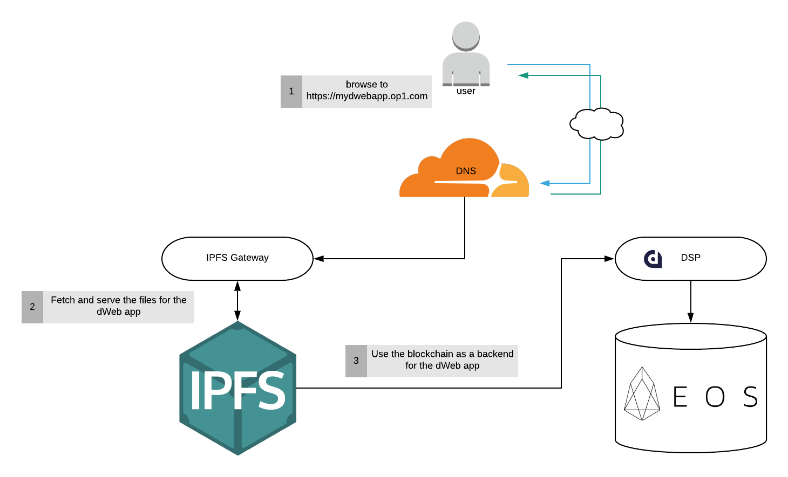
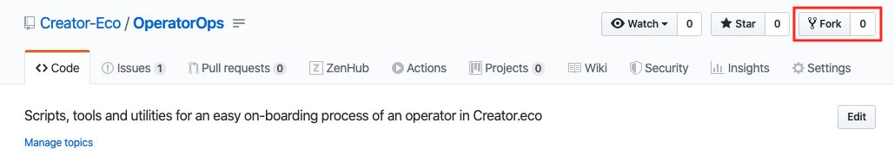
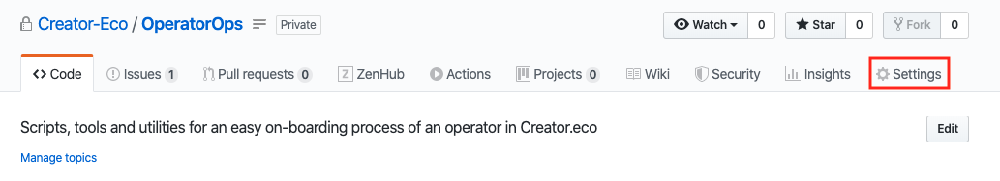
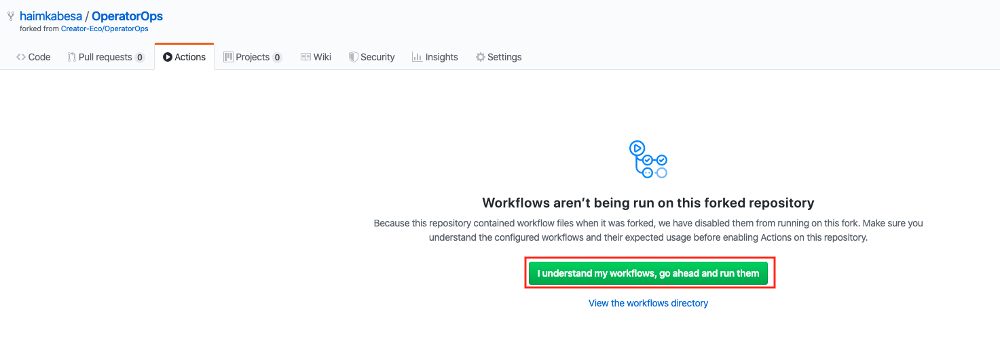
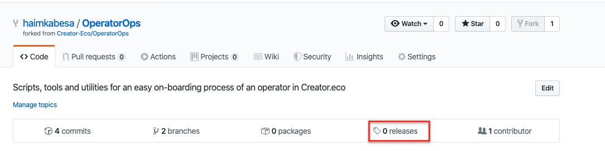
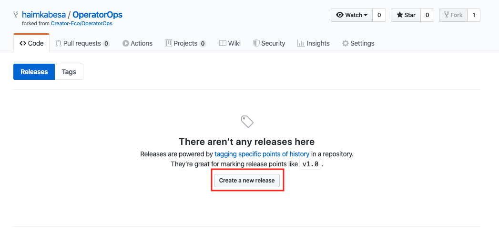
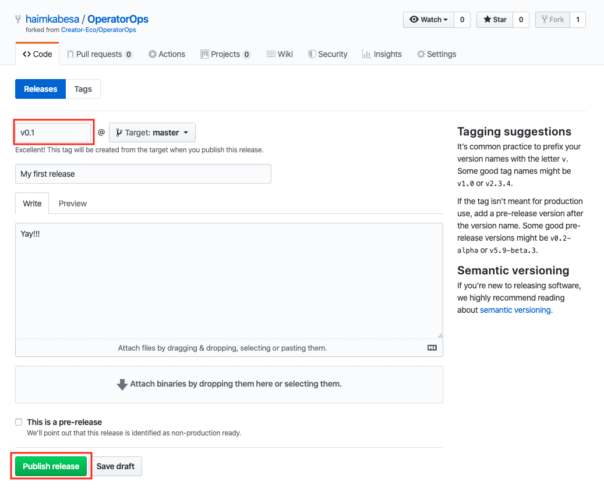
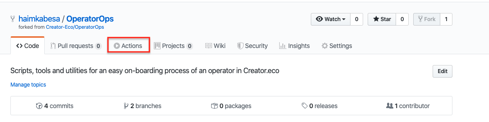

# How to become a Creator.eco Operator?

> **Please Note!**    
The below guide will walk you through the steps are needed in order to deploy the **Creator.eco Operator** components to the Production environment.  
If you wish to first test and operate the system in a more controlled environment, please refer to this [guide](https://google.com). 

The **Creator.eco Operator** role is one of the most fundamental building blocks of the **Creator.eco** ecosystem.  
A **Creator.eco Operator** has many responsibilities. Among them are managing the lifecycle of the **WebApp**, maintaining security, preserving the availability and reliability of the **WebApp** and customization for the target market.

For more in-depth information about the **Creator.eco** role, and the other roles in the eocsystem please check [here](https://google.com).


### Table of contents:
1. [Introduction](#introduction)
2. [Prerequisites](#prerequisites)
3. [Configuration Architecture](#architecture)
4. [Installation process overview](#install-overview)
5. [Work environment arrangment](#work-env-arrange)  
    5.1. [Fork the OperatorOps github's repository](#fork)  
    5.2. [Collect API secrets](#collect-apis)  
    5.3. [Configure GitHub's actions pipeline secrets](#create-secrets)  
    5.4. [Activate the github's actions pipeline](#activte-pipe)  
    5.5. [Create a Release and run the installation process](#create-release)  
    5.6. [Installation validation](#install-validation)  
6. [Summary](#summary)


### Intorduction <a name="introduction"></a>

Below you will find a step-by-step guide that will provide you all the necessary components to be a **Creator.eco Operator**. 

Although we use specific *service providers* ([*Cloudflare*](https://www.cloudflare.com/), [*Pinata*](https://pinata.cloud/) etc.) in this guide, plase note that each of this services has alternatives, and you are more than welcome to choose other service providers, and use them in your personal installation process.

Please note, as we've tested many configurations combinations for the *service providers* stack along the way, we've found that the *service providers* list below enable the most easy-to-use and configure installation process.

1. [Blockstart Base Package](https://dsphq.io/packages/blockstartac/ipfsservice1/blockpack2) as a DSP (dApp Service Provider) package.  
2. [Pinata](https://pinata.cloud/) as an IPFS pinning service.  
3. [Cloudflare](https://www.cloudflare.com/) as a DNS configuration service. 


### Prerequisites <a name="prerequisites"></a>

In order to complete this guide and become a **Creator.eco Operator**, you will need the following:

1. Own a Domain Name.
2. An active EOS account with a balance of 10000 DAPP tokens.  
3. An active [GitHub](https://github.com/) account.
4. An active [Pinata](https://pinata.cloud/signup) account.
5. An active [Cloudflare](https://dash.cloudflare.com/sign-up) account. 

  > You can purchase DAPP tokens by using the [Bancor](https://www.bancor.network) or [NewDex](https://www.newdex.io).

  > For all the needed accounts mentioned above besides EOS, the offered **free** plan of each of those services is good enough for you in order to complete this guide.


### Configuration Architecture <a name="architecture"></a>




### Installation process overview <a name="install-overview"></a>

The **Creator.eco Operator** installation process consists of 5 major steps:

1. Select a DSP and a DSP package to use.
2. Stake DAPP tokens to the selected DSP.
3. Deploy the **Creator.eco Core** smart contract to the EOS blockchain.
4. Upload the **Application** to the IPFS network.
5. Configure your DNS to point to the **Application**.  

Although the above steps may look complex at first glance, don't worry, most of this process is automated via a GitHub's actions pipeline.  
If you are not familiar with GitHub's actions, it's simply an automation framework that helps developers automate their workflow and manage their application lifecycle.
As you will see in the next steps, we will utilize this automation framework in the journy to become an Creator.eco Operator. 


### Work environment arrangment: <a name="work-env-arrange"></a> 
First thing first, before we can deploy anything, we need to arrange our work environment.


#### 1. Fork the OperatorOps github's repository. <a name="fork"></a>
1. Login to your GitHub.com account.
   > if you don't have one already, you can create a new account [here](https://github.com/join?source=login).
2. Navigate to the [Creator-Eco/OperatorOps](https://github.com/Creator-Eco/OperatorOps) repository.
3. On the upper-right side click the **Fork** button, to copy the repo to your account.
   
   

Great!! You now have your own copy of the **Creator.eco Core** source code.  
In the next step, we'll configure GitHub's actions pipeline. 


#### 2. Collect API secrets. <a name="collect-apis"></a>

Our GitHub's actions pipeline will work with the API of each of the *service providers* we mentioned above (Cloudflare, Pinata, etc.), in order to do that the GitHub's actions pipeline will use a dedicated API key for each of services.  

In this step we will create a separate GitHub's actions [Secret](https://help.github.com/en/actions/automating-your-workflow-with-github-actions/creating-and-using-encrypted-secrets) variable that will be used later in the pipeline.

- EOS private key:  
  > With this key GitHub's actions pipeline will be able to deploy the **Creator.eco Core** smart contract to the EOS blockchain.  
  
  Depends on the way you've created your EOS account, either you used the ```cleos``` CLI or via an online service such as [Scatter](https://support.get-scatter.com/article/33-creating-an-eos-account), this guide assumes that you have access to your EOS account's private key.

- Pinata API key:
  > With this key GitHub's actions pipeline will be able to upload and start pinning the **Creator.eco appliaction** files in IPFS.
   
1. Connect to your [Pinata](https://pinata.cloud/signup) account.
2. In the upper-right corner, click on your profile image and navigate to your **Account Page**.
3. In the **Account Page**, the relevat values exists under the **PINATA API KEY** and **PINATA SECRET API KEY** fields.
   


- Cloudflare API key:
  > With this key GitHub's actions pipeline will be able to configure your DNS to point to the location of the **Creator.eco appliaction** you uploded to IPFS.

1. Connect to your [Cloudflare](https://dash.cloudflare.com/sign-up) account.
2. In the upper-right corner, click on your **My profile** button and navigate to you profile homepage.
3. Navigate to the **API Tokens** tab.
4. Click the **Create Token** button.
5. Fill the form as following:


6. Click the **Continue to Summary** button, and then the **Create Token** button.
7. Save the API token you are provided for later use.

Super Baller!!! We now have all the necessary secrets in order to activate the OperatorOps GitHub's actions pipeline.


#### 3. Configure GitHub's actions pipeline secrets. <a name="create-secrets"></a>

In this step we'll create a dedicated secret variable for each of the API secrets we collected in the privious step.
1. In the *OperatorOps* repository homepage, click the **Settings** tab and then select the **Secrets** tab.  
  

2. For each of the API secrets you collected earlier, create a **Secret** variable with the corresponding names:
      ```
      Name: EOS_PRIVATE_KEY
      Value: <Your EOS private key>

      Name: PINATA_API_KEY
      Value: <Your Pinata api key>

      Name: PINATA_SECRET_API_KEY
      Value: <Your Pinata secret api key>

      Name: CLOUDFLARE_API_KEY
      Value: <Your Cloudflare api key> 

      Name: CLOUDFLARE_ZONE_ID
      Value: <Your Cloudflare zone id> 
      ```
   At the end of the process, your setup should look like this...
     

Yay! Now that we defined all the secrets we need, let's go and activate the github's actions pipeline.


#### 4. Activate the github's actions pipeline. <a name="activte-pipe"></a>

1. Navigate to the **Actions** tab and activate the workflow.
  


#### 5. Create a Release and run the installation process. <a name="create-release"></a>

In order to run the github's actions pipeline, we'll need to create a [Release](https://help.github.com/en/github/administering-a-repository/about-releases).  
A *Release* in software, is a term that was coined long ago, and referring to the ability to track a product's functionality over time by assigning a version schema (v1.0, v1.1, etc) for each release.
A new release can consists of new features, bug fixes, documentation, etc. that were missing in a previous release of the product, and added to the current release.

Our GitHub's actions pipeline is configured to run with every new `Release` created in the repository.

In this step we will create a `Release` in our repository which will then will trigger a run of the GitHub's actions pipeline attached to the repository.

The pipeline will do the following: 
1. Deploy the EOS contracts to EOS mainnet.
2. Upload the web app to IPFS (via Pinata)
3. Configure your DNS to point to the web app (via Cloudflare)

At the end of the installation process, the web app will be available through the domain you provided in the steps above.

Create a Release:  
1. In the *OperatorOps* repository homepage, click the **Releases** tab.


2. In the **Releases** page, click the **Create a new release** button.


3. Fill the new **Release** form as showing below, and click the **Publish release** button.


Woohoo! in this step we created a Release and successfully triggered the installation process, in the next step, we will explore the installation process run and validate that everything works as expected.


#### 6. Installation validation. <a name="install-validation"></a>

1. In the *OperatorOps* repository homepage, click the **Actions** tab.


2. In the **All workflows** table, click on the first top item in the table (If this is your first time running the pipeline, you should have only one item in the table)


3. Validate that each of the steps in the pipeline is marked with a green check mark.


### Summary <a name="summary"></a>
Awesome!
you've made it!
Well done.

You can now navigate to your domain and view the web app. 
