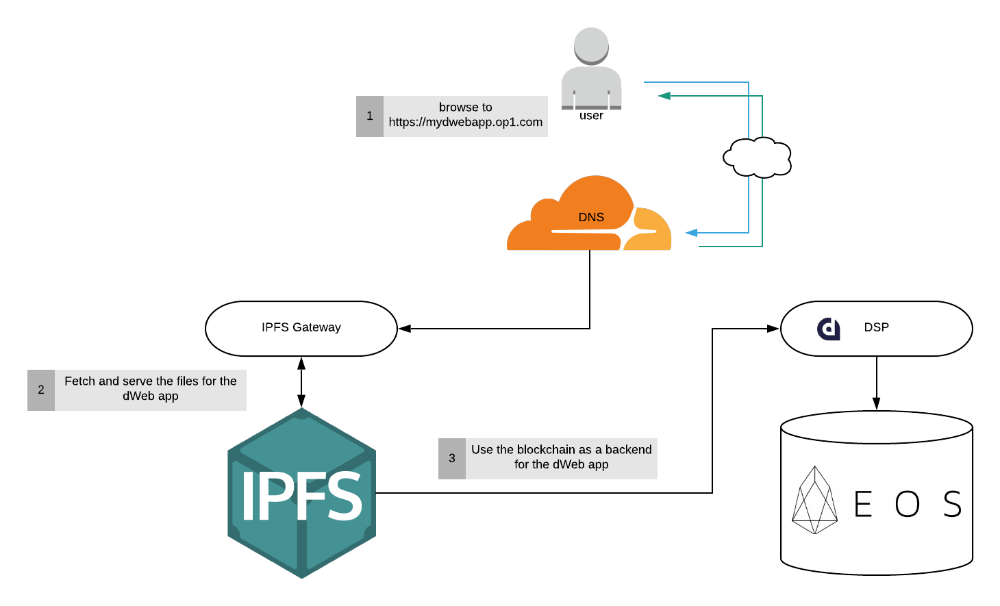

## System Architecture  

The above diagram illustrates the relationship between the different components that the **Creator.eco Operator** (CEO) resposible for.  

It all starts with a user that browsing to the CEO's website, the DNS service that serving the CEO's domain resolves the request and return an endpoint to an IPFS gateway, the IPFS gateway will then fetch the webapp files that associated with the CEO's domain from the IPFS, and then will enable the access to the website.  
The website uses the EOS blockchain and the IPFS as its backend, so for example, if the website need to store a user profile picture, it will use the IPFS for that, while if the website need to modify the website users' list, it will use the blockchain for that.  
The data that being stored on the blockchain is stored in the tables of the smart contract that the CEO deployed to his account.

The DSP (dApp service provider) exposes an abstraction layer that enhance some of the EOS's blockchain capabilities such as using RAM, CPU, creating accounts, etc. in more efficient manner. The website will mostly interact with the DSP layer in order to access the blockchain.  

An immortal web application is one that there is no way to shut it down (unless it's the CEO who does that) by hacking into the server that host the web application. An immortal web application preserves security all the way from its frontend to its backend with high resiliency for user's changes over time.  

Refernces:
- IPFS: [What is IPFS?](https://docs.ipfs.io/introduction/overview/) 
- Pinata & Cloudflare: [How to Easily Host a Website on IPFS](https://medium.com/pinata/how-to-easily-host-a-website-on-ipfs-9d842b5d6a01) 
- Immortal app: [Easy, Free, and Forever: The First Immortal LiquidApp is Live!](https://medium.com/the-liquidapps-blog/easy-to-use-free-immortal-ipfs-blockchain-dapp-e1e73e776722)
- DAPP Service Provider: [DAPP: The Way to Web 3.0](https://medium.com/the-liquidapps-blog/scalability-flexibility-and-interoperability-web3-liquidapps-six-month-report-c8bfce09f29)

  
Next: [Installation Process Overview](04-overview.md)  
Previous: [Prerequisites](02-prerequisites.md)
