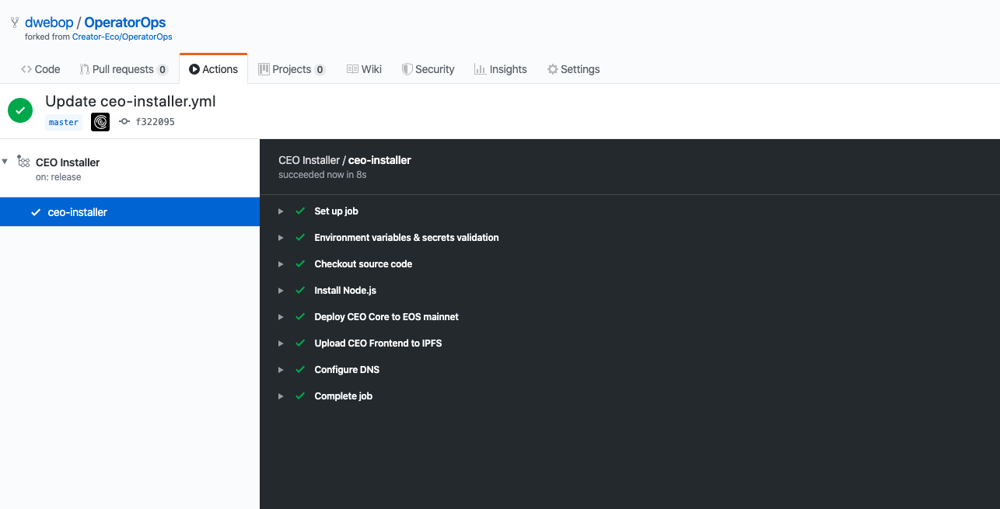

## Work Environment Arrangement  

In the next steps, we'll arrange our work environment in order to ensure that the **Github Actions** pipeline will have all the neccasery data before we'll able to run it.

Arrange our work environment:
1. [Fork the OperatorOps GitHub's repository](docs/06-fork-repo.md)  
2. [Collect API secrets](docs/07-collect-api-keys.md)  
3. [Configure GitHub's actions pipeline secrets](docs/08-create-secrets.md)  
4. [Activate the GitHub's actions pipeline](docs/09-activate-pipeline.md)  

  
Next: [Fork the OperatorOps GitHub's repository](06-fork-repo.md)  
Previous: [Installation Process Overview](04-overview.md)   