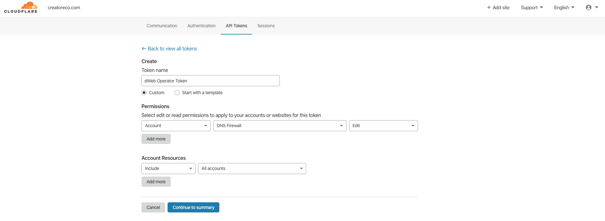

#### 2. Collect API secrets. <a name="collect-apis"></a>

The GitHub's actions pipeline will work with the API of each *service providers* we mentioned above (Cloudflare, Pinata, etc.). In order to do that the GitHub's actions pipeline will use a dedicated API key provided by each of the services.  

In this step we will create a separate GitHub's actions [Secret](https://help.github.com/en/actions/automating-your-workflow-with-github-actions/creating-and-using-encrypted-secrets) variable that will be used later in the pipeline.

- EOS private key:  
  > With this key GitHub's actions pipeline will be able to deploy the **CEO Core** smart contracts to the EOS blockchain.  
  
  Depending on the way you created your EOS account, either via the ```cleos``` CLI or via a service such as [Scatter](https://support.get-scatter.com/article/33-creating-an-eos-account), this guide assumes that you have access to your EOS account's private key.

- Pinata API key:
  > With this key GitHub's actions pipeline will be able to upload and start pinning the **CEO Default UI** files on IPFS.
   
1. Login to your [Pinata](https://pinata.cloud/signup) account.
2. In the upper-right corner, click on your profile image and navigate to your **Account Page**.
3. In the **Account Page**, the relevant values exist under the **PINATA API KEY** and **PINATA SECRET API KEY** fields.
   


- Cloudflare API key:
  > With this key GitHub's actions pipeline will be able to configure your DNS to point to the location of the **CEO Default UI** you uploded to IPFS.

1. Login to your [Cloudflare](https://dash.cloudflare.com/sign-up) account.
2. In the upper-right corner, click on the **My profile** button.
3. Click the **API Tokens** tab.
4. Click  **Create Token**.
5. Fill the form as following:



6. Click  **Continue to Summary**, and then **Create Token**.
7. Save the API token you are provided for later use.

We now have all the necessary secrets in order to activate the GitHub's actions pipeline.

Next: [Configure GitHub's actions pipeline secrets](docs/08-create-secrets.md)