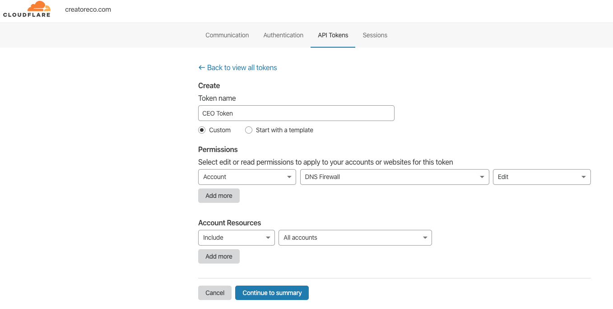
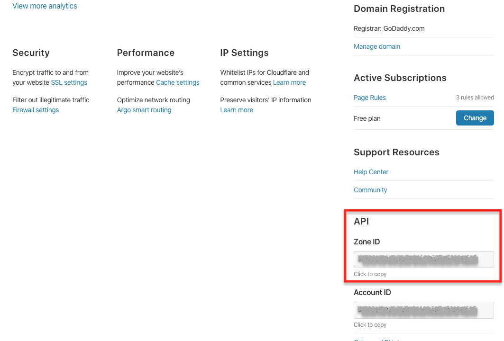

## Collect API Keys and Secrets

The GitHub Actions pipeline is configured to work with the API of each of the services in the service providers stack we mentioned earlier.  
In order to do so the GitHub Actions pipeline uses dedicated API keys (secrets) provided by each of the services.  

In this step we will collect those keys from the different service providers. 

- **EOS private key**:  
  > With this key the GitHub Actions pipeline will be able to deploy the **CEO Core** smart contract to the EOS blockchain.  
  
  Depending on the way you created your EOS account, either via the ```cleos``` CLI or via a service such as [Scatter](https://support.get-scatter.com/article/33-creating-an-eos-account), this guide assumes that you have access to your EOS account's private key.

- **Pinata API keys**:
  > With this keys the GitHub Actions pipeline will be able to upload the **CEO Frontend** files to the IPFS network.
   
1. Login to your [Pinata](https://pinata.cloud/signup) account.
2. In the upper-right corner, click on your profile image and navigate to your **Account Page**.
3. In the **Account Page**, the relevant values exist under the **PINATA API KEY** and **PINATA SECRET API KEY** fields.
4. Save the API keys you are provided for later use.


- **Cloudflare API Token & Zone ID**:
  > With this keys the GitHub Actions pipeline will be able to configure the Cloudflare DNS to point to the location of the **CEO Frontend** you uploded to the IPFS network.

    **API Token:**
    1. Login to your [Cloudflare](https://dash.cloudflare.com/sign-up) account.
    2. In the upper-right corner, click on the **My profile** button.
    3. Click the **API Tokens** tab.
    4. Click  **Create Token**.
    5. Fill the form as following:

    

    6. Click  **Continue to Summary**, and then **Create Token**.
    7. Save the API token you are provided for later use.

    **Zone ID:**
    1. Navigate to your [Cloudflare Dashboard](https://dash.cloudflare.com/)
    2. Select the site that serves your domain.
    3. On the **Overview** tab, scroll down the page and serach for the **API** section
    4. Save the Zone ID you are provided for later use.
    
    

    **Email Address:**
    1. Login to your [Cloudflare](https://dash.cloudflare.com/sign-up) account.
    2. In the upper-right corner, click on the **My profile** button.
    3. Click the **Communication** tab.
    4. Save the value of the Email Address for later use.


We now have all the API keys we need, next, we'll create a [Secret](https://help.github.com/en/actions/automating-your-workflow-with-github-actions/creating-and-using-encrypted-secrets) variable for each of the API keys which will later be used by the pipeline.

<br/><br/>
Next: [Configure GitHub's actions pipeline secrets](08-create-secrets.md)  
Previous:  [Fork the OperatorOps GitHub's repository](06-fork-repo.md)  
