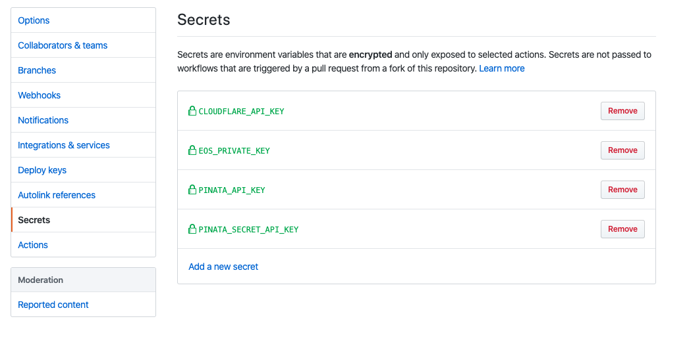

#### 3. Configure GitHub's actions pipeline secrets. <a name="create-secrets"></a>

In this step we'll create a dedicated secret variable for each of the API secrets collected in the previous step.
1. In the *OperatorOps* repository homepage, click the **Settings** tab and then select the **Secrets** tab.  
  

2. For each of the API secrets you collected earlier, create a **Secret** variable with the corresponding names:
      ```
      Name: EOS_PRIVATE_KEY
      Value: <Your EOS private key>

      Name: PINATA_API_KEY
      Value: <Your Pinata api key>

      Name: PINATA_SECRET_API_KEY
      Value: <Your Pinata secret api key>

      Name: CLOUDFLARE_API_KEY
      Value: <Your Cloudflare api key> 

      Name: CLOUDFLARE_ZONE_ID
      Value: <Your Cloudflare zone id> 
      ```
   At the end of the process, your setup should look like this...
     

Yay! Now that we defined all the secrets we need, let's activate the GitHub's actions pipeline.


Next: [Activate the GitHub's actions pipeline](docs/09-activate-pipeline.md)