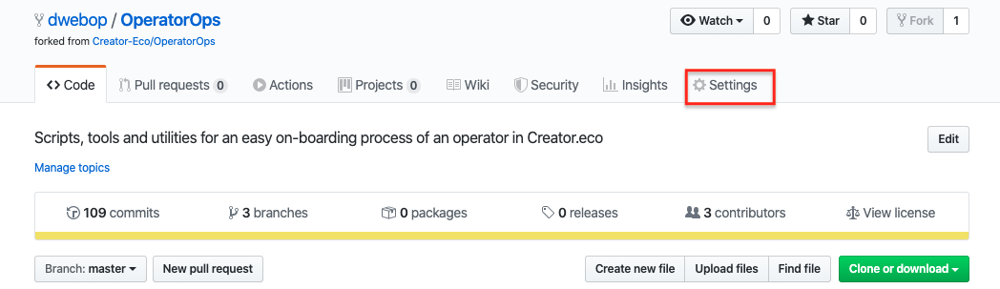
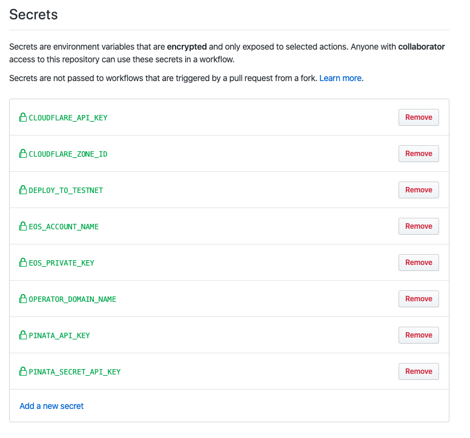

## Configure GitHub's actions pipeline secrets  

In this step we'll create a dedicated secret variable for each of the API secrets collected in the previous step.
1. In the *OperatorOps* repository homepage, click the **Settings** tab and then select the **Secrets** tab.  
  

2. For each of the API secrets you collected earlier, create a **Secret** variable with the corresponding names:
      ```
      Name: EOS_PRIVATE_KEY
      Value: <Your EOS private key>

      Name: PINATA_API_KEY
      Value: <Your Pinata api key>

      Name: PINATA_SECRET_API_KEY
      Value: <Your Pinata secret api key>

      Name: CLOUDFLARE_API_KEY
      Value: <Your Cloudflare api key> 

      Name: CLOUDFLARE_ZONE_ID
      Value: <Your Cloudflare zone id> 
      ```
   At the end, your setup should look like this...
     

Great! now we created the secrets variables the pipeline expect to be exists, we're almost done... next, we'll activate the GitHub's Actions pipeline


<br/><br/>
Next: [Activate the GitHub's Actions pipeline](09-activate-pipeline.md)
Previous: [Collect API secrets](07-collect-api-keys.md)  