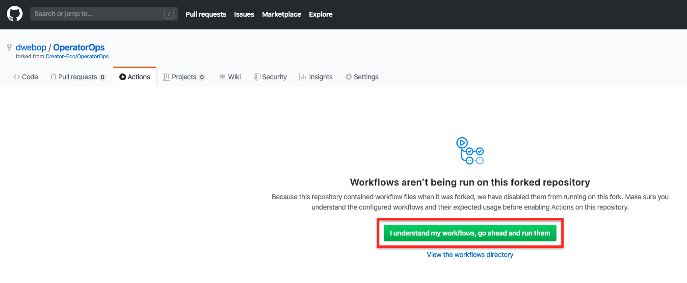

## Enable the GitHub's actions pipeline  

The GitHub Action pipeline is not enabled for your repository by default, therefore before running the pipeline we first need to enable it.

1. Navigate to the **Actions** tab and activate the workflow.
  

  
Next: [Create a Release and run the installation process](10-create-release.md)  
Previous: [Configure GitHub's actions pipeline secrets](08-create-secrets.md)  