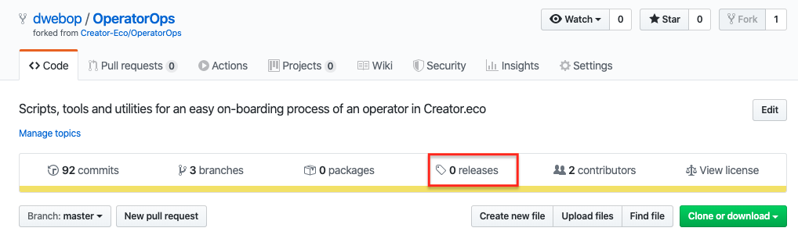
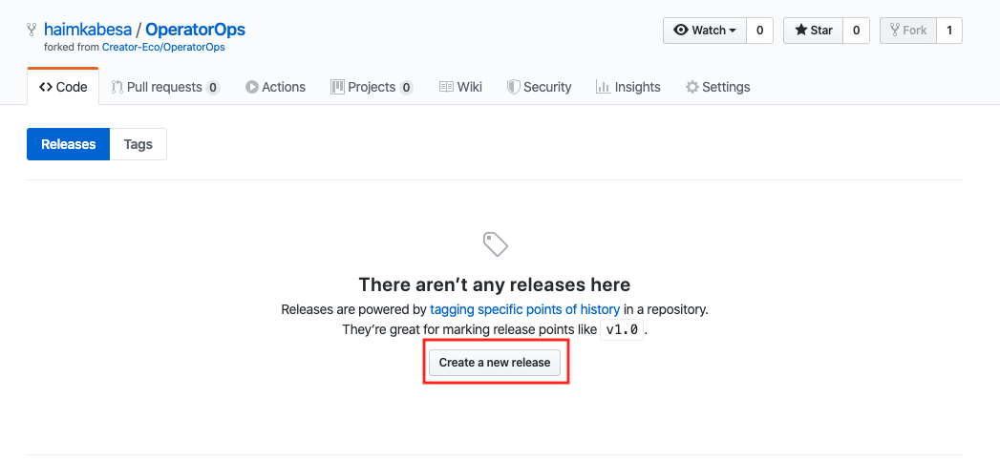
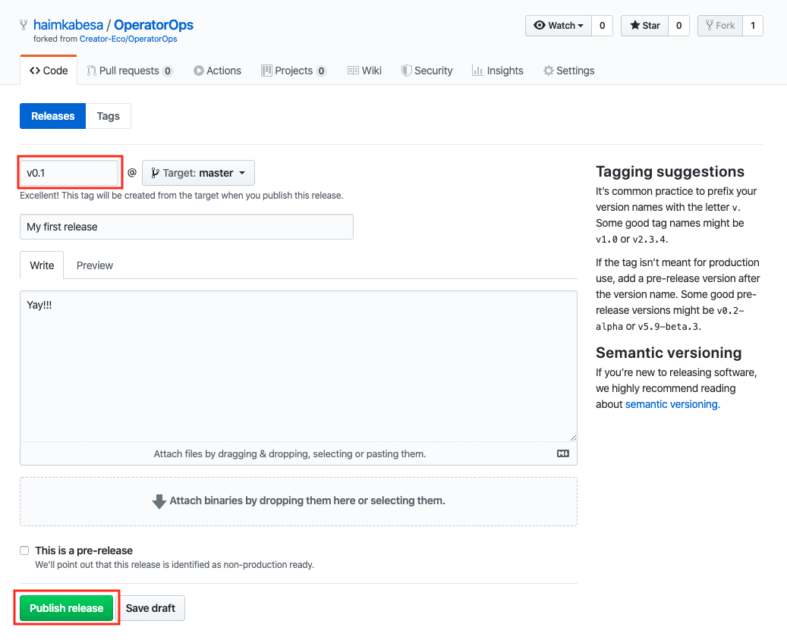

#### 5. Create a Release and run the installation process. 

In order to run the GitHub's actions pipeline, we'll need to create a [Release](https://help.github.com/en/github/administering-a-repository/about-releases).  
A *Release* in software, is a term that was coined long ago referring to the ability to track a product's functionality over time by assigning a version schema (v1.0, v1.1, etc) for each release.
A new release can consists of new features, bug fixes, documentation, etc. that were missing in a previous release of the product, and added to the current release.

Our GitHub's actions pipeline is configured to run with every new `Release` created in the repository.

In this step we will create a `Release` in our repository which will trigger running of the GitHub's actions pipeline attached to the repository.

The pipeline will: 
1. Deploy the EOS contracts to EOS mainnet.
2. Upload the **CEO Default UI** to IPFS (via Pinata)
3. Configure your DNS to point to the **CEO Default UI** (via Cloudflare)

At the end of the installation process, the **CEO Default UI** will be available at the domain you provided.

Create a Release:  
1. In the *OperatorOps* repository homepage, click the **Releases** tab.

2. In the **Releases** page, click **Create a new release**.

3. Fill the new **Release** form as shown below, and click  **Publish release**.

Woohoo! In this step we created a Release and successfully triggered the installation process.

In the next step, we will review the installation process to verify that everything works as expected.

Next: [Installation validation](docs/11-validation.md)