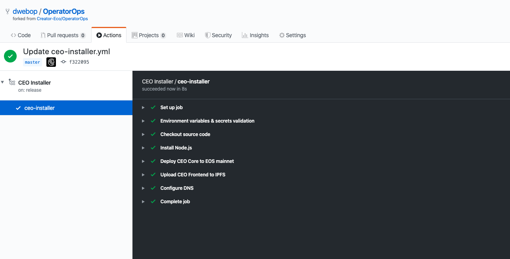

## Installation validation  

1. In the *OperatorOps* repository homepage, click the **Actions** tab.

2. In the **All workflows** table, click on the top item in the table (If this is your first time running the pipeline, you should have only one item in the table)

3. Validate that each of the steps in the pipeline is marked with a green check mark.

  
Next: [Summary](12-summary.md)  
Previous: [Create a Release and run the installation process](10-create-release.md)  
