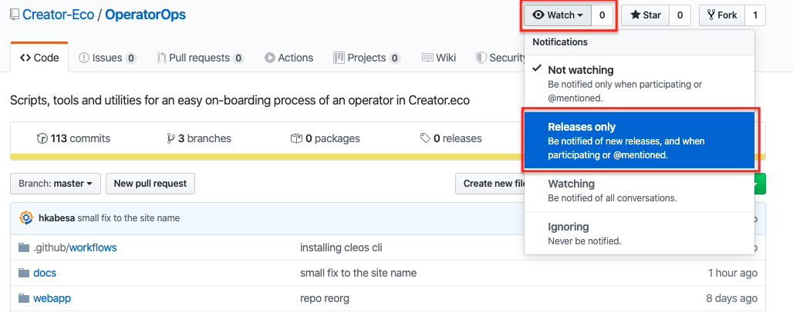
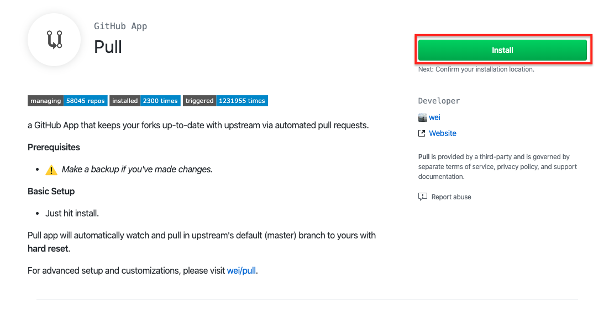
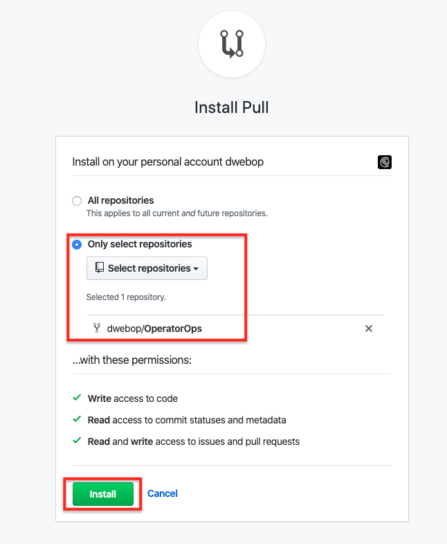

## Miscellaneous

1. #### Product Updates notification

    Our dev team publishes new releases of the **CEO Core** frequently.   
    In order to be notified about new features, bug fixes and security improvements in the product, you can click the *watch* button in [CreatorEco/OperatorOps](https://github.com/Creator-Eco/OperatorOps) repository.  
    This will allow you to receive email notifications anytime we publish a new release.

    

2. #### Easy syncing of your fork  

    There's more than one way to sync your fork (i.e. your copy of the [CreatorEco/OperatorOps](https://github.com/Creator-Eco/OperatorOps) repository) with the upstream repository. For example, [this](https://help.github.com/en/github/collaborating-with-issues-and-pull-requests/syncing-a-fork) tutorial will guide you through the required steps.

    Using the [Pull](https://github.com/apps/pull) GitHub App (kudos to [@wei](https://github.com/wei)) is the easiest way we found to sync a fork with its upstream repository. The configuration process of this GitHub App is super simple and doesn't require any technical expertise.
    
    Instructions:

    1. Install the [Pull](https://github.com/apps/pull) GitHub App in your GitHub account.
       
       

    2. Select the **Only select repositories** checkbox and then select the **OperatorOps** repository.

        

    3. Click **Install**
    4. You're done.

        

    The **Pull** app will automatically look for new updates in the upstream repository, once those will be found, the app will merge them to your fork via a Pull Request mechanism.
    
    The **Pull** app default configuration will look for updates every 1 hour. You can change this behavior using a [custom configuration](https://github.com/wei/pull#readme) of your choise.
